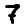
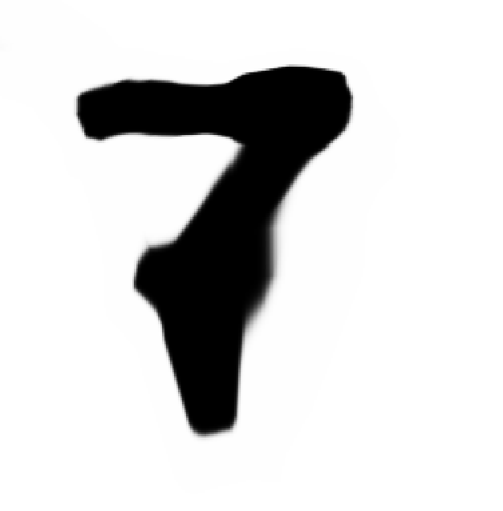

## Neural network

This is a very simple implementation of a neural network.

- It doesn't use any external libraries, all the math is implemented inside this repository.
- The results aren't optimal because there is no optimizer (eg. adam)

## Graphics

On the branch `origin/graphics-testing`

The neural network has been implemented to learn based on a pixel position how bright the pixel should be.
The pixel position is normalized to a number between 0 and 1 so that it can be upscaled.
For example when training on an image with a small resolution (28x28) `assets/number-7.png`,
I converted these images to CSV files since they are easy to read, see `data/numbers/number-7.csv`.

**Input:**

**Output:**

Note: to generate the other numbers you may need to change the hyperparameters